# アーキテクチャ設計書

## プロジェクト概要

**目的**: FX取引において設定したルール以外の操作を完全にブロックする半自動取引システム

**コンセプト**: DB駆動のルールエンジンにより、人間の感情的な判断を排除し、機械的にルールを遵守させる

---

## 技術スタック選定

### バックエンド
- **Runtime**: Node.js 20.x LTS
- **Framework**: Express 4.x
- **Language**: TypeScript 5.x
- **ORM**: Prisma 5.x
- **Validation**: Zod

**選定理由**:
- 最も情報量が多く、枯れた技術スタック
- AIペアプログラミング前提で、コード生成の品質が高い
- FX取引bot実装事例が豊富
- 非同期処理に強く、リアルタイム価格取得に適している

### フロントエンド
- **Library**: React 18.x
- **Language**: TypeScript 5.x
- **Build Tool**: Vite
- **State Management**: Zustand（軽量でシンプル）
- **CSS**: Tailwind CSS（固定、自前CSS禁止）
- **UI Components**: shadcn/ui（Tailwind対応、最近人気）
- **Charts**: Recharts（ルール比較の視覚化用）

**選定理由**:
- React は情報量No.1のフロントエンドライブラリ
- Tailwind CSSでスタイル管理を統一、AI生成との相性も良い
- shadcn/ui は情報量急増中、カスタマイズ性高い
- Recharts はReact用で最も情報が多く、ルール比較の可視化に最適

### データベース
- **RDBMS**: MySQL 8.x
- **Migration**: Prisma Migrate

**選定理由**:
- 情報量が非常に多い
- JSON型サポートで柔軟なデータ設計が可能
- トランザクション処理が堅牢

### 外部API
- **FX API**: OANDA v20 REST API

---

## システムアーキテクチャ全体像

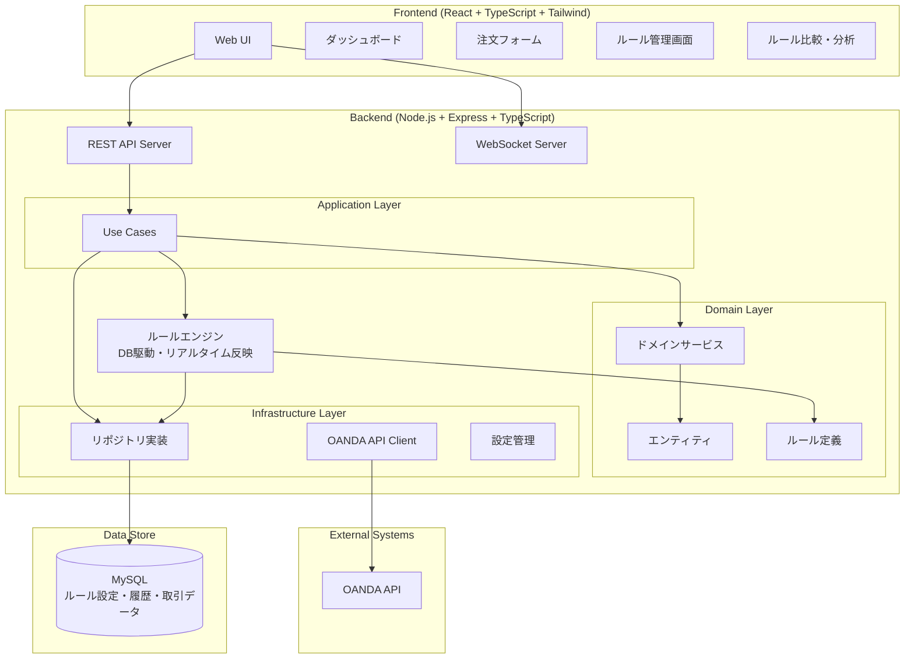

---

## レイヤードアーキテクチャ + DDD

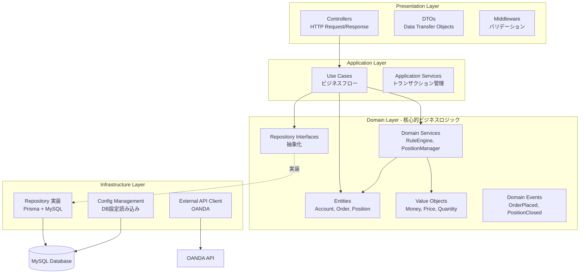

### 各レイヤーの責務

| レイヤー | 責務 | 外部依存 |
|---------|------|---------|
| **Presentation** | HTTP通信、リクエスト/レスポンス変換 | Express, DTOs |
| **Application** | ユースケース実装、複数ドメインサービスの組み合わせ | Domain Layer |
| **Domain** | **純粋なビジネスロジック**、ルール定義 | **なし** |
| **Infrastructure** | DB接続、外部API通信、環境変数読み込み | Prisma, OANDA SDK |

---

## DB駆動ルールエンジン

### 設計思想

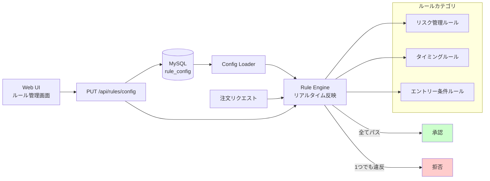

### ルール管理の2つのモード

**ドラフトモード（日常的な調整）**
- Web UIでルールを自由に変更
- リアルタイムで反映（システム再起動不要）
- 変更履歴は記録されるが、成績とは紐づけない

**スナップショットモード（恒久記録）**
- 本気で運用するルールセットを「コミット」
- 一意のバージョンで管理
- このルールでの全取引を記録
- 後で複数ルールセットの成績を視覚的に比較

### ルールカテゴリ

#### 1. リスク管理ルール
ポジションサイズ制限、損切り・利確設定、日次損失制限、レバレッジ制限

#### 2. 取引タイミングルール
取引可能時間帯、取引可能曜日、経済指標前後の取引制限

#### 3. エントリー条件ルール
テクニカル指標の閾値（RSI, MA, BBなど）、トレンド判定条件

#### 4. 通貨ペア・スプレッド制限
取引可能通貨ペア、最大許容スプレッド

**詳細**: [docs/RULE_MANAGEMENT.md](./docs/RULE_MANAGEMENT.md) を参照

---

## ドメインモデル設計

### エンティティ関係図

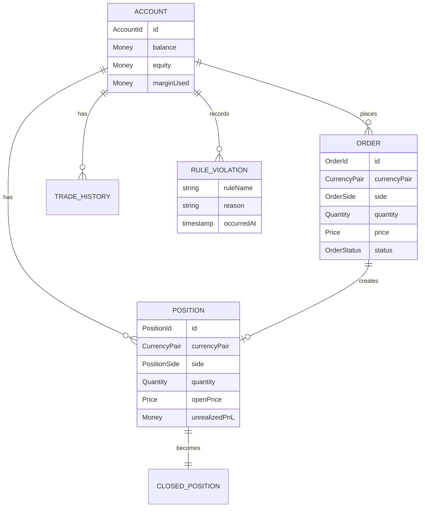

### ドメインサービス関係図

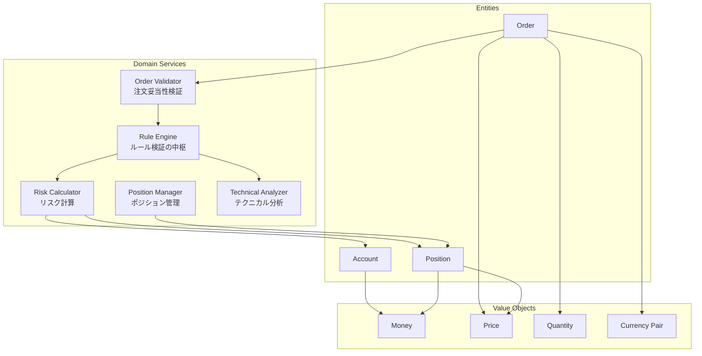

---

## データフロー

### 注文実行フロー

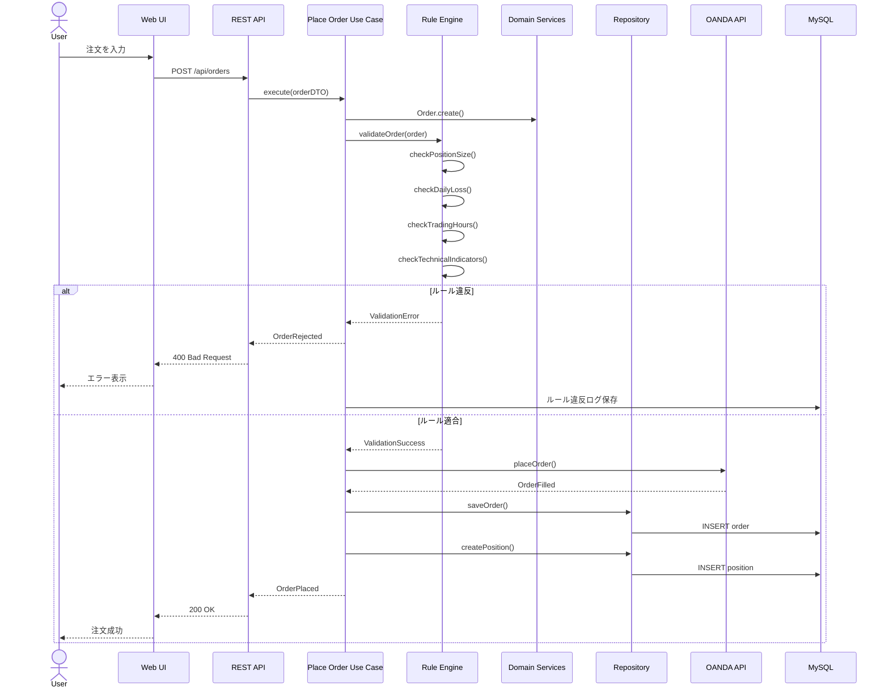

### リアルタイム価格更新フロー

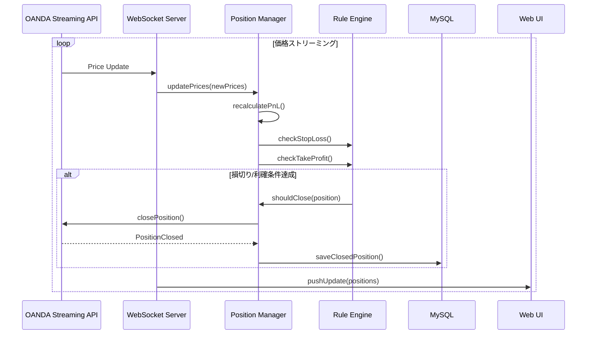

---

## データベース設計概要

### テーブル構成

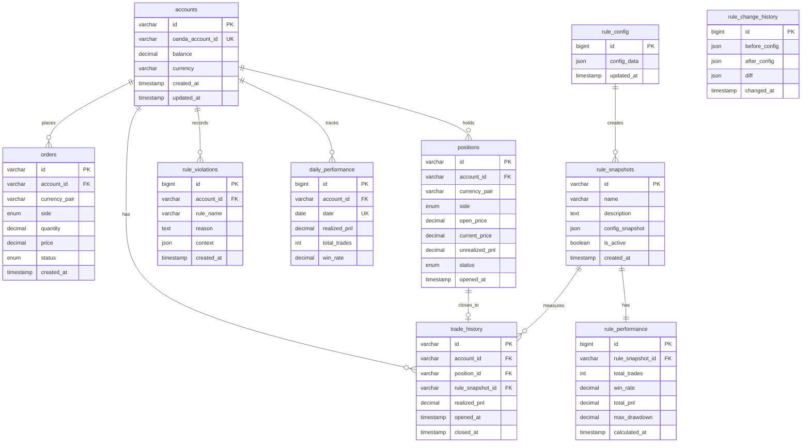

---

## API設計概要

### REST API エンドポイント構成

```mermaid
graph TB
    subgraph "アカウント"
        Account["/api/account"]
    end

    subgraph "取引"
        Orders["/api/orders/*"]
        Positions["/api/positions/*"]
    end

    subgraph "ルール管理"
        RulesConfig["/api/rules/config"]
        RulesSnapshots["/api/rules/snapshots"]
        RulesCompare["/api/rules/compare"]
        RulesValidate["/api/rules/validate"]
        RulesViolations["/api/rules/violations"]
    end

    subgraph "市場データ"
        MarketPrices["/api/market/prices"]
        MarketCandles["/api/market/candles"]
        MarketIndicators["/api/market/indicators"]
    end

    subgraph "分析"
        Analytics["/api/analytics/*"]
    end

    Client["Web Client"] --> Account
    Client --> Orders
    Client --> Positions
    Client --> RulesConfig
    Client --> RulesSnapshots
    Client --> RulesCompare
    Client --> RulesValidate
    Client --> RulesViolations
    Client --> MarketPrices
    Client --> Analytics
```

### WebSocket 接続

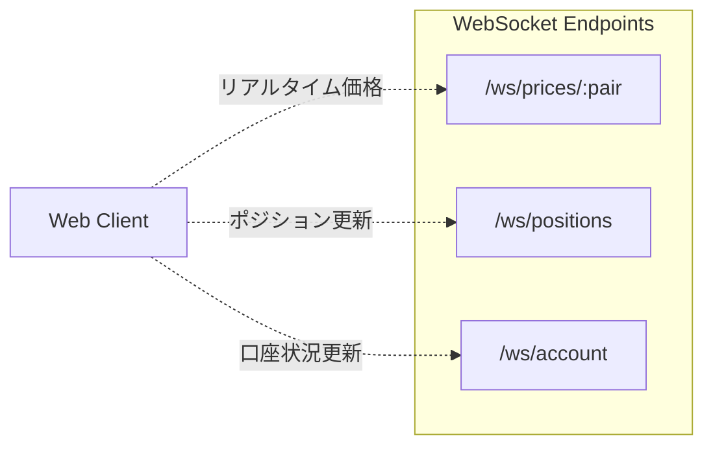

---

## セキュリティ・運用設計

### 前提条件

- **使用者**: 個人（1名）のみ
- **稼働環境**: ローカル環境
- **認証**: 不要（自分しかアクセスしない）

---

### セキュリティ対策

#### 1. OANDA APIキーの管理

**最重要**: APIキーは絶対に公開しない

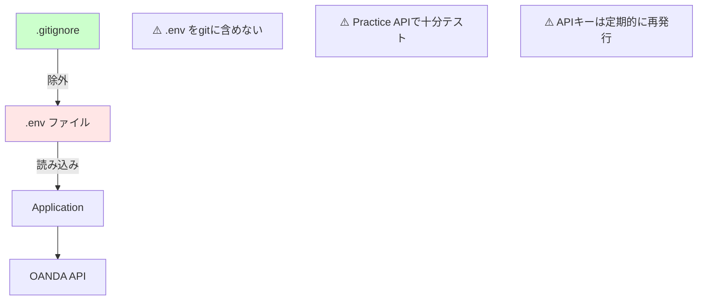

**環境変数の設定例**:
```bash
# .env (gitignoreで除外)
OANDA_API_KEY=your_practice_api_key_here
OANDA_ACCOUNT_ID=your_account_id_here
OANDA_API_URL=https://api-fxpractice.oanda.com

# 本番環境では以下に変更
# OANDA_API_URL=https://api-fxtrade.oanda.com
```

---

#### 2. ローカル環境のセキュリティ

**ローカル稼働時**:
- ユーザー認証不要（自分しかアクセスしない）
- `localhost` のみでリッスン
- ファイアウォール設定不要

**処理フロー**:
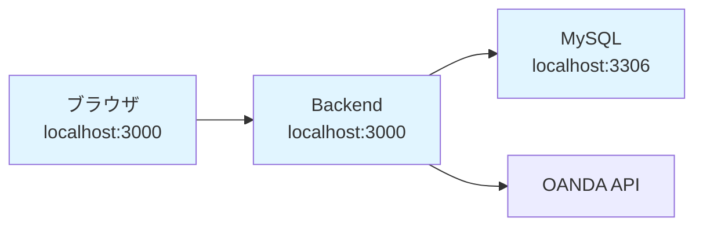

---

### 運用上の重要な注意点

#### 1. Practice APIで徹底的にテスト

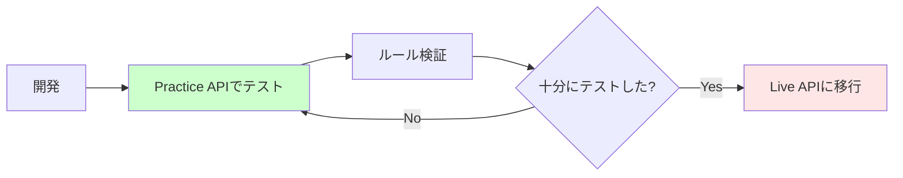

**最低限のテスト期間**:
- ルール調整: 1週間以上
- 本格運用前: 1ヶ月以上推奨

---

#### 2. データバックアップ

**バックアップ戦略**:
```bash
# 日次自動バックアップ（cron）
0 3 * * * mysqldump -u user -p luchida > /backup/luchida_$(date +\%Y\%m\%d).sql
```

**保持期間**:
- 日次バックアップ: 30日間
- 月次バックアップ: 1年間

---

#### 3. ログ管理

**ログレベル**:
- **Development**: `debug` - 全ての詳細ログ
- **Production**: `info` - 重要なイベントのみ

**記録すべきイベント**:
- 全ての注文実行（成功・失敗）
- ルール違反
- OANDA API エラー
- システムエラー

**ログローテーション**:
```bash
# ログファイルが10MBを超えたらローテーション
# 最大10ファイルまで保持
```

---

#### 4. モニタリング

**監視項目**:
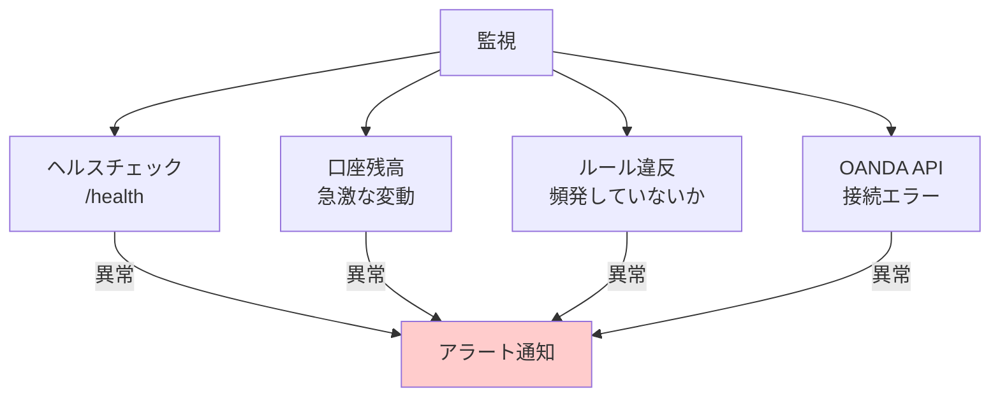

**アラート通知方法**（将来的に実装）:
- Slackへの通知
- メール通知
- Discordへの通知

---

### セキュリティチェックリスト

- [ ] `.env` ファイルを `.gitignore` に追加
- [ ] OANDA APIキーは Practice API で開始
- [ ] データベースのバックアップ設定
- [ ] Practice APIで最低1週間テスト
- [ ] 定期バックアップの自動化（cronで設定）
- [ ] ログローテーション設定

---

## 開発フェーズ

### Phase 1: MVP（最小機能）
- 環境構築・基盤整備
- ドメインモデル実装
- ルールエンジン実装（DB駆動）
- OANDA API連携
- 基本UI実装（ルール管理、注文、ポジション管理）

### Phase 2: 機能拡張
- ルールスナップショット機能
- ルール比較・可視化（Recharts）
- 詳細分析機能
- パフォーマンスレポート

### Phase 3: 高度化（将来）
- バックテスト機能
- ルール最適化機能
- 機械学習によるルール提案

---

## ディレクトリ構造（概要）

```
luchida/
├── backend/
│   ├── src/
│   │   ├── presentation/        # Controllers, DTOs, Middleware
│   │   ├── application/         # Use Cases, Application Services
│   │   ├── domain/              # Entities, Value Objects, Domain Services
│   │   ├── infrastructure/      # Repositories, External API, Config
│   │   └── shared/              # 共通ユーティリティ
│   ├── prisma/                  # DB Schema, Migrations
│   ├── tests/                   # テストコード
│   └── .env                     # 環境変数（gitignore）
├── frontend/
│   ├── src/
│   │   ├── components/          # Reactコンポーネント
│   │   ├── pages/               # ページコンポーネント
│   │   ├── services/            # API通信
│   │   ├── stores/              # 状態管理
│   │   └── utils/               # ユーティリティ
│   └── public/
├── docs/
│   ├── ARCHITECTURE.md          # 本ドキュメント
│   ├── API.md                   # API仕様書
│   └── RULES.md                 # ルール詳細仕様
├── .env.example                 # 環境変数テンプレート
└── README.md
```

---

## 参考資料・学習リソース

- [OANDA v20 API Documentation](https://developer.oanda.com/rest-live-v20/introduction/)
- [Domain-Driven Design](https://www.domainlanguage.com/ddd/)
- [Layered Architecture Pattern](https://martinfowler.com/bliki/PresentationDomainDataLayering.html)
- [Clean Architecture](https://blog.cleancoder.com/uncle-bob/2012/08/13/the-clean-architecture.html)
- [Prisma Documentation](https://www.prisma.io/docs)
- [TypeScript Handbook](https://www.typescriptlang.org/docs/)
- [Express.js Best Practices](https://expressjs.com/en/advanced/best-practice-performance.html)
