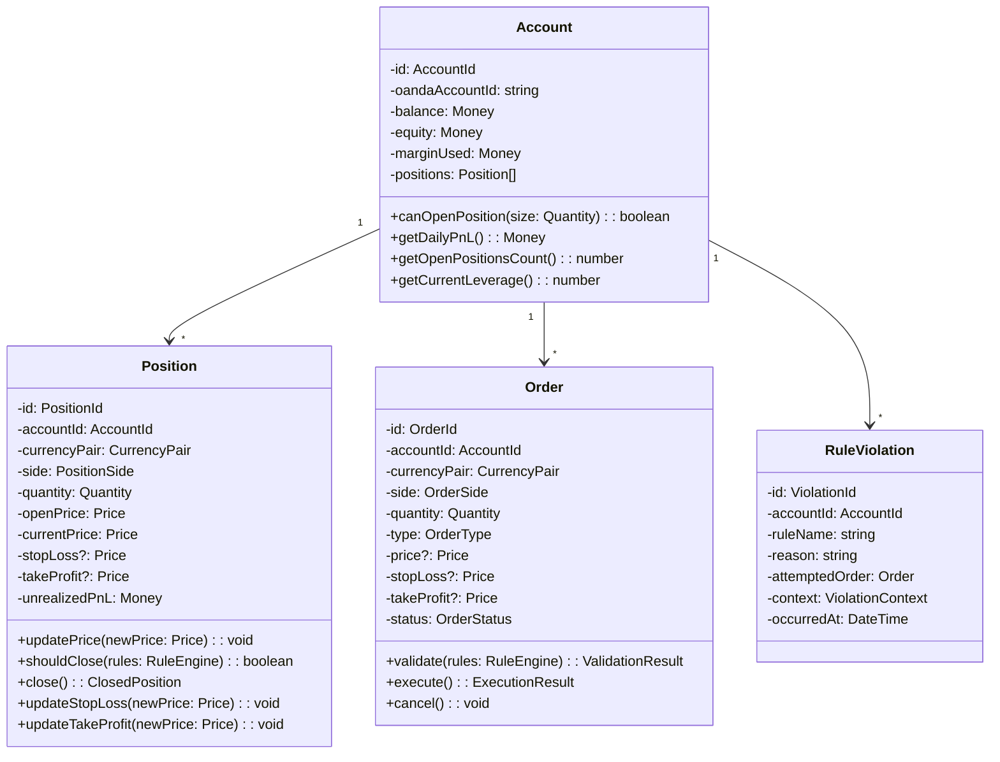
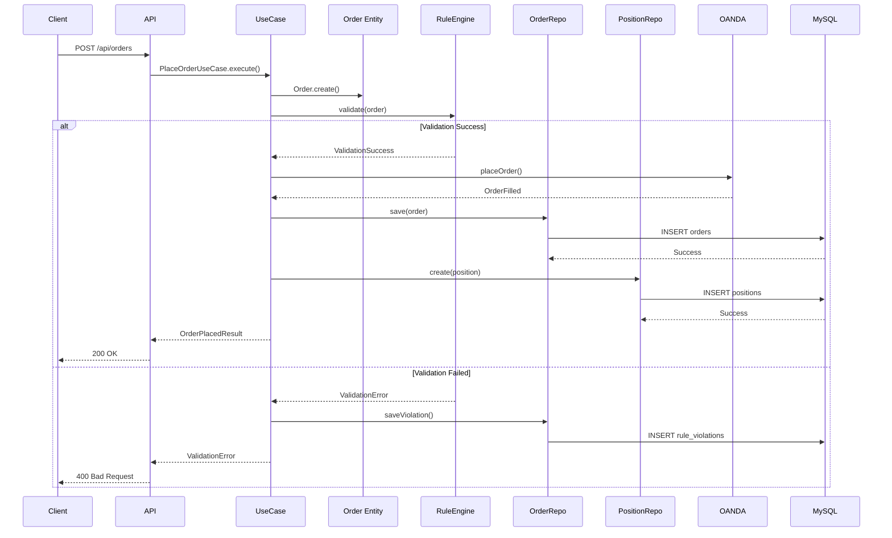
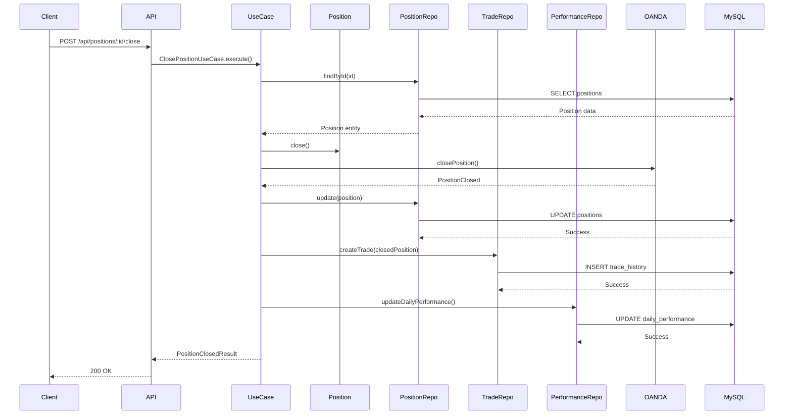
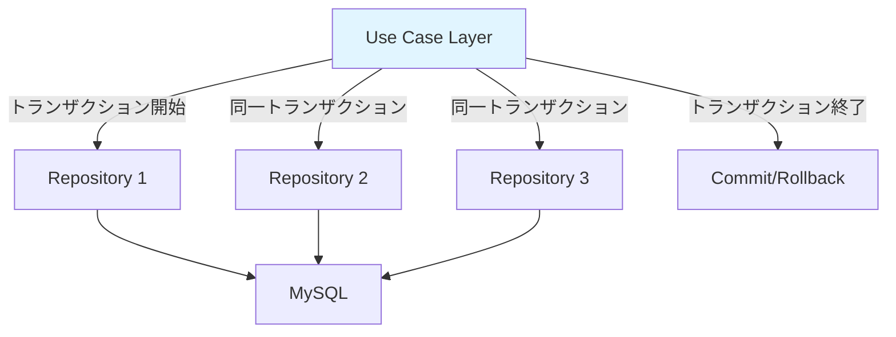
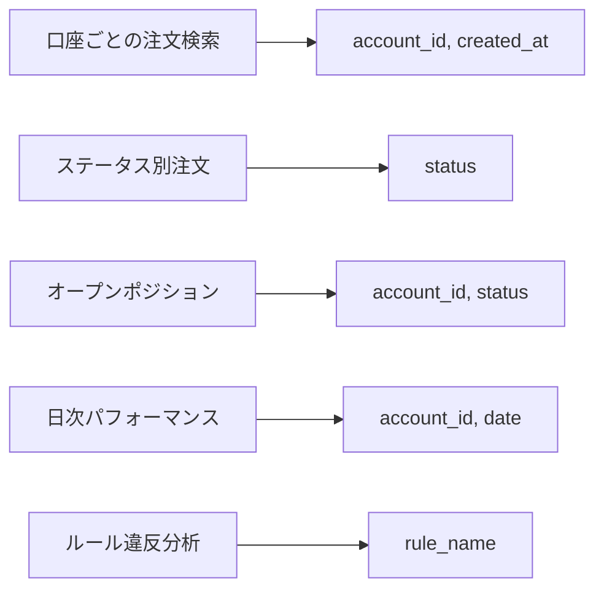
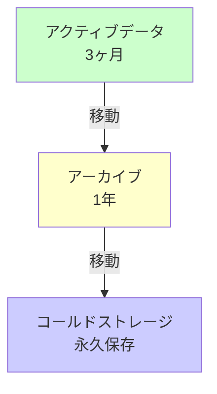

# データベース設計書

## 概要

このドキュメントでは、データベーススキーマとドメインモデルの詳細を定義します。

---

## ER図（Entity Relationship Diagram）

```mermaid
erDiagram
    accounts ||--o{ orders : places
    accounts ||--o{ positions : holds
    accounts ||--o{ rule_violations : records
    accounts ||--o{ trade_history : generates
    accounts ||--o{ daily_performance : tracks

    positions ||--o| trade_history : closes_to
    orders ||--o| positions : creates

    accounts {
        varchar(36) id PK
        varchar(255) oanda_account_id UK
        varchar(255) name
        decimal(15,2) balance
        varchar(3) currency
        timestamp created_at
        timestamp updated_at
    }

    orders {
        varchar(36) id PK
        varchar(36) account_id FK
        varchar(10) currency_pair
        enum side "BUY, SELL"
        enum type "MARKET, LIMIT, STOP"
        decimal(15,4) quantity
        decimal(15,5) price
        decimal(15,5) stop_loss
        decimal(15,5) take_profit
        enum status "PENDING, FILLED, CANCELLED, REJECTED"
        decimal(15,5) filled_price
        timestamp filled_at
        timestamp created_at
    }

    positions {
        varchar(36) id PK
        varchar(36) account_id FK
        varchar(10) currency_pair
        enum side "LONG, SHORT"
        decimal(15,4) quantity
        decimal(15,5) open_price
        decimal(15,5) current_price
        decimal(15,5) stop_loss
        decimal(15,5) take_profit
        decimal(15,2) unrealized_pnl
        timestamp opened_at
        timestamp closed_at
        enum status "OPEN, CLOSED"
    }

    rule_violations {
        bigint id PK
        varchar(36) account_id FK
        varchar(255) rule_name
        text violation_reason
        json attempted_order
        json context
        timestamp created_at
    }

    trade_history {
        varchar(36) id PK
        varchar(36) account_id FK
        varchar(36) position_id FK
        varchar(10) currency_pair
        enum side "LONG, SHORT"
        decimal(15,4) quantity
        decimal(15,5) open_price
        decimal(15,5) close_price
        decimal(15,2) realized_pnl
        timestamp opened_at
        timestamp closed_at
        int duration_seconds
    }

    daily_performance {
        bigint id PK
        varchar(36) account_id FK
        date date UK
        decimal(15,2) starting_balance
        decimal(15,2) ending_balance
        decimal(15,2) realized_pnl
        decimal(15,2) unrealized_pnl
        int total_trades
        int winning_trades
        int losing_trades
    }

    rule_config_history {
        bigint id PK
        json config_snapshot
        varchar(255) changed_by
        text change_reason
        timestamp applied_at
    }
```

---

## テーブル定義

### accounts（口座）

**目的**: OANDAアカウントと残高情報を管理

| カラム | 型 | NULL | キー | 説明 |
|--------|-------|------|------|------|
| id | VARCHAR(36) | NO | PK | UUID |
| oanda_account_id | VARCHAR(255) | NO | UK | OANDA Account ID |
| name | VARCHAR(255) | YES | - | アカウント名 |
| balance | DECIMAL(15,2) | YES | - | 残高 |
| currency | VARCHAR(3) | YES | - | 通貨コード（JPY, USDなど） |
| created_at | TIMESTAMP | NO | - | 作成日時 |
| updated_at | TIMESTAMP | NO | - | 更新日時 |

**インデックス**:
- PRIMARY KEY: `id`
- UNIQUE: `oanda_account_id`

---

### orders（注文）

**目的**: 全ての注文履歴を記録

| カラム | 型 | NULL | キー | 説明 |
|--------|-------|------|------|------|
| id | VARCHAR(36) | NO | PK | UUID |
| account_id | VARCHAR(36) | NO | FK | 口座ID |
| currency_pair | VARCHAR(10) | NO | - | 通貨ペア（例: USD_JPY） |
| side | ENUM | NO | - | BUY, SELL |
| type | ENUM | NO | - | MARKET, LIMIT, STOP |
| quantity | DECIMAL(15,4) | NO | - | 数量 |
| price | DECIMAL(15,5) | YES | - | 指値価格 |
| stop_loss | DECIMAL(15,5) | YES | - | 損切り価格 |
| take_profit | DECIMAL(15,5) | YES | - | 利確価格 |
| status | ENUM | NO | - | PENDING, FILLED, CANCELLED, REJECTED |
| filled_price | DECIMAL(15,5) | YES | - | 約定価格 |
| filled_at | TIMESTAMP | YES | - | 約定日時 |
| created_at | TIMESTAMP | NO | - | 注文作成日時 |

**インデックス**:
- PRIMARY KEY: `id`
- FOREIGN KEY: `account_id` → `accounts(id)`
- INDEX: `(account_id, created_at)` - 口座ごとの注文履歴検索
- INDEX: `(status)` - ステータス別検索

---

### positions（ポジション）

**目的**: 現在保有中および過去のポジションを管理

| カラム | 型 | NULL | キー | 説明 |
|--------|-------|------|------|------|
| id | VARCHAR(36) | NO | PK | UUID |
| account_id | VARCHAR(36) | NO | FK | 口座ID |
| currency_pair | VARCHAR(10) | NO | - | 通貨ペア |
| side | ENUM | NO | - | LONG, SHORT |
| quantity | DECIMAL(15,4) | NO | - | 数量 |
| open_price | DECIMAL(15,5) | NO | - | エントリー価格 |
| current_price | DECIMAL(15,5) | NO | - | 現在価格 |
| stop_loss | DECIMAL(15,5) | YES | - | 損切り価格 |
| take_profit | DECIMAL(15,5) | YES | - | 利確価格 |
| unrealized_pnl | DECIMAL(15,2) | YES | - | 含み損益 |
| opened_at | TIMESTAMP | NO | - | オープン日時 |
| closed_at | TIMESTAMP | YES | - | クローズ日時 |
| status | ENUM | NO | - | OPEN, CLOSED |

**インデックス**:
- PRIMARY KEY: `id`
- FOREIGN KEY: `account_id` → `accounts(id)`
- INDEX: `(account_id, status)` - 口座ごとのオープンポジション検索

---

### rule_violations（ルール違反ログ）

**目的**: 全てのルール違反を記録・分析

| カラム | 型 | NULL | キー | 説明 |
|--------|-------|------|------|------|
| id | BIGINT | NO | PK | Auto Increment |
| account_id | VARCHAR(36) | NO | FK | 口座ID |
| rule_name | VARCHAR(255) | NO | - | 違反したルール名 |
| violation_reason | TEXT | NO | - | 違反理由の詳細 |
| attempted_order | JSON | YES | - | 試みた注文の詳細 |
| context | JSON | YES | - | 違反時のコンテキスト |
| created_at | TIMESTAMP | NO | - | 記録日時 |

**context JSONの例**:
```json
{
  "accountBalance": 100000,
  "dailyPnL": -3000,
  "openPositions": 4,
  "currentLeverage": 8.5,
  "marketConditions": {
    "spread": 2.5,
    "rsi": 45
  }
}
```

**インデックス**:
- PRIMARY KEY: `id`
- FOREIGN KEY: `account_id` → `accounts(id)`
- INDEX: `(account_id, created_at)` - 時系列検索
- INDEX: `(rule_name)` - ルール別集計

---

### trade_history（取引履歴）

**目的**: クローズされた取引の履歴を保存

| カラム | 型 | NULL | キー | 説明 |
|--------|-------|------|------|------|
| id | VARCHAR(36) | NO | PK | UUID |
| account_id | VARCHAR(36) | NO | FK | 口座ID |
| position_id | VARCHAR(36) | NO | FK | 元のポジションID |
| currency_pair | VARCHAR(10) | NO | - | 通貨ペア |
| side | ENUM | NO | - | LONG, SHORT |
| quantity | DECIMAL(15,4) | NO | - | 数量 |
| open_price | DECIMAL(15,5) | NO | - | エントリー価格 |
| close_price | DECIMAL(15,5) | NO | - | クローズ価格 |
| realized_pnl | DECIMAL(15,2) | NO | - | 確定損益 |
| opened_at | TIMESTAMP | NO | - | オープン日時 |
| closed_at | TIMESTAMP | NO | - | クローズ日時 |
| duration_seconds | INT | YES | - | 保有時間（秒） |

**インデックス**:
- PRIMARY KEY: `id`
- FOREIGN KEY: `account_id` → `accounts(id)`
- INDEX: `(account_id, closed_at)` - 時系列検索
- INDEX: `(realized_pnl)` - 損益順ソート

---

### daily_performance（日次パフォーマンス）

**目的**: 日ごとの取引成績を集計

| カラム | 型 | NULL | キー | 説明 |
|--------|-------|------|------|------|
| id | BIGINT | NO | PK | Auto Increment |
| account_id | VARCHAR(36) | NO | FK | 口座ID |
| date | DATE | NO | UK | 日付 |
| starting_balance | DECIMAL(15,2) | YES | - | 開始残高 |
| ending_balance | DECIMAL(15,2) | YES | - | 終了残高 |
| realized_pnl | DECIMAL(15,2) | YES | - | 確定損益 |
| unrealized_pnl | DECIMAL(15,2) | YES | - | 含み損益 |
| total_trades | INT | NO | - | 取引回数 |
| winning_trades | INT | NO | - | 勝ちトレード数 |
| losing_trades | INT | NO | - | 負けトレード数 |

**インデックス**:
- PRIMARY KEY: `id`
- FOREIGN KEY: `account_id` → `accounts(id)`
- UNIQUE: `(account_id, date)`
- INDEX: `(date)` - 日付検索

---

### rule_config_history（ルール設定履歴）

**目的**: 環境変数の変更履歴を記録

| カラム | 型 | NULL | キー | 説明 |
|--------|-------|------|------|------|
| id | BIGINT | NO | PK | Auto Increment |
| config_snapshot | JSON | NO | - | 全環境変数のスナップショット |
| changed_by | VARCHAR(255) | YES | - | 変更者 |
| change_reason | TEXT | YES | - | 変更理由 |
| applied_at | TIMESTAMP | NO | - | 適用日時 |

**config_snapshot JSONの例**:
```json
{
  "MAX_POSITION_SIZE": 10000,
  "STOP_LOSS_PIPS": 20,
  "MAX_DAILY_LOSS": 5000,
  "RSI_ENABLED": true,
  "RSI_OVERSOLD": 30,
  ...
}
```

**インデックス**:
- PRIMARY KEY: `id`
- INDEX: `(applied_at)` - 時系列検索

---

## ドメインモデル

### エンティティ



### 値オブジェクト（Value Objects）

```mermaid
classDiagram
    class Money {
        -amount: number
        -currency: Currency
        +add(other: Money): Money
        +subtract(other: Money): Money
        +multiply(factor: number): Money
        +isGreaterThan(other: Money): boolean
        +isLessThan(other: Money): boolean
        +equals(other: Money): boolean
    }

    class Price {
        -value: number
        -currencyPair: CurrencyPair
        +pipsTo(other: Price): number
        +add(pips: number): Price
        +subtract(pips: number): Price
    }

    class Quantity {
        -units: number
        +isWithinRange(min: Quantity, max: Quantity): boolean
        +multiply(factor: number): Quantity
    }

    class CurrencyPair {
        -base: Currency
        -quote: Currency
        +toString(): string
        +getPipValue(): number
    }

    class OrderSide {
        <<enumeration>>
        BUY
        SELL
        +opposite(): OrderSide
    }

    class PositionSide {
        <<enumeration>>
        LONG
        SHORT
        +opposite(): PositionSide
    }

    class OrderType {
        <<enumeration>>
        MARKET
        LIMIT
        STOP
    }

    class OrderStatus {
        <<enumeration>>
        PENDING
        FILLED
        CANCELLED
        REJECTED
    }
```



---

## データフロー

### 注文作成から実行までのデータフロー



### ポジションクローズのデータフロー



---

## トランザクション設計

### トランザクション境界



**トランザクションスコープ**:
- **Use Case単位**: 1つのユースケース実行が1トランザクション
- **複数リポジトリ操作**: 同一トランザクション内で実行
- **外部API呼び出し**: トランザクション外で実行し、失敗時は補償トランザクション

---

## インデックス戦略

### パフォーマンス最適化のためのインデックス



---

## データ保持戦略

### アーカイブ



---

## 今後の拡張

### Phase 2
- **market_data** テーブル: 価格履歴、ローソク足データ
- **indicators** テーブル: 計算済みテクニカル指標のキャッシュ

### Phase 3
- **backtest_results** テーブル: バックテスト結果
- **optimization_history** テーブル: ルール最適化履歴
