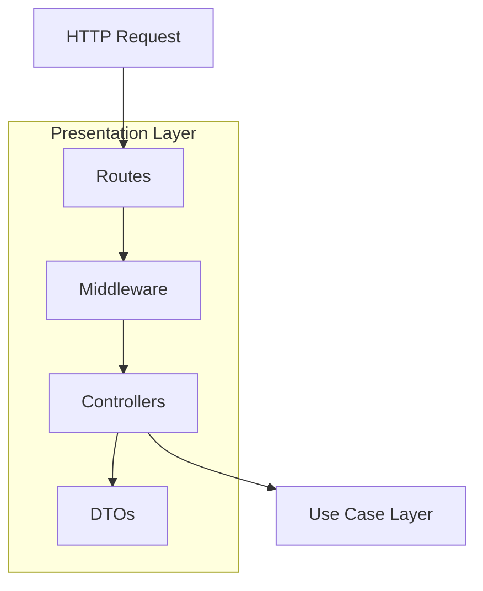
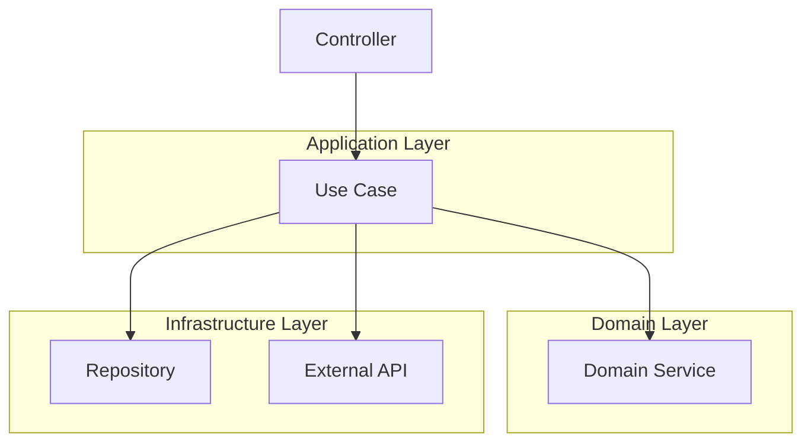
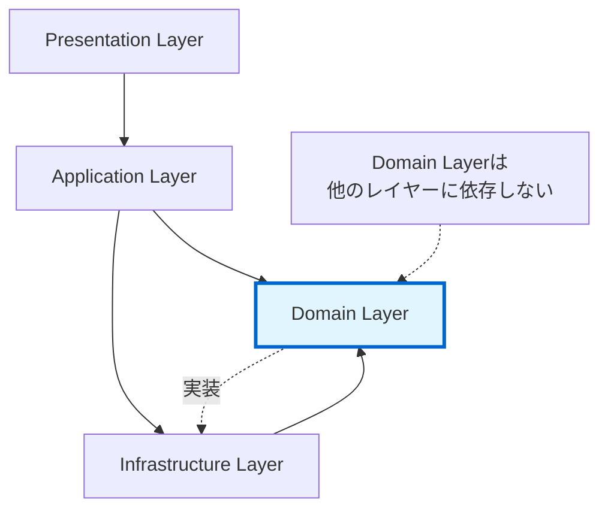

# ディレクトリ構造設計

## 概要

このドキュメントでは、プロジェクト全体のディレクトリ構造を定義します。
レイヤードアーキテクチャ + DDD の原則に従い、各レイヤーを明確に分離します。

---

## 全体構造

```
luchida/
├── backend/                    # バックエンドアプリケーション
├── frontend/                   # フロントエンドアプリケーション
├── docs/                       # ドキュメント
├── scripts/                    # ユーティリティスクリプト
├── .env.example                # 環境変数テンプレート
├── .gitignore
├── README.md
├── ARCHITECTURE.md
└── LICENSE
```

---

## バックエンド構造

```
backend/
├── src/
│   ├── presentation/           # プレゼンテーション層
│   │   ├── controllers/        # HTTPコントローラー
│   │   ├── dtos/               # Data Transfer Objects
│   │   ├── middleware/         # ミドルウェア
│   │   ├── routes/             # ルート定義
│   │   └── websocket/          # WebSocketハンドラー
│   │
│   ├── application/            # アプリケーション層
│   │   ├── usecases/           # ユースケース
│   │   └── services/           # アプリケーションサービス
│   │
│   ├── domain/                 # ドメイン層（中核）
│   │   ├── entities/           # エンティティ
│   │   ├── value-objects/      # 値オブジェクト
│   │   ├── services/           # ドメインサービス
│   │   ├── repositories/       # リポジトリインターフェース
│   │   ├── events/             # ドメインイベント
│   │   └── rules/              # ルール定義
│   │
│   ├── infrastructure/         # インフラストラクチャ層
│   │   ├── database/           # データベース関連
│   │   │   ├── repositories/   # リポジトリ実装
│   │   │   ├── migrations/     # マイグレーション
│   │   │   └── seeds/          # シードデータ
│   │   ├── external-api/       # 外部API
│   │   │   ├── oanda/          # OANDA API Client
│   │   │   └── news/           # 経済指標API
│   │   ├── config/             # 設定管理
│   │   └── cache/              # キャッシュ
│   │
│   ├── shared/                 # 共通モジュール
│   │   ├── types/              # 共通型定義
│   │   ├── constants/          # 定数
│   │   ├── utils/              # ユーティリティ
│   │   ├── errors/             # カスタムエラー
│   │   └── logger/             # ロガー
│   │
│   └── main.ts                 # エントリーポイント
│
├── prisma/                     # Prisma設定
│   ├── schema.prisma           # DBスキーマ定義
│   └── migrations/             # マイグレーション履歴
│
├── tests/                      # テストコード
│   ├── unit/                   # ユニットテスト
│   ├── integration/            # 統合テスト
│   ├── e2e/                    # E2Eテスト
│   └── fixtures/               # テストフィクスチャ
│
├── .env                        # 環境変数（gitignore）
├── .env.test                   # テスト用環境変数
├── package.json
├── tsconfig.json
├── jest.config.js
└── nodemon.json
```

---

## バックエンド - レイヤー別詳細

### Presentation Layer（プレゼンテーション層）



```
presentation/
├── controllers/
│   ├── auth.controller.ts           # 認証コントローラー
│   ├── account.controller.ts        # アカウントコントローラー
│   ├── order.controller.ts          # 注文コントローラー
│   ├── position.controller.ts       # ポジションコントローラー
│   ├── rule.controller.ts           # ルール関連コントローラー
│   ├── market.controller.ts         # 市場データコントローラー
│   └── analytics.controller.ts      # 分析コントローラー
│
├── dtos/
│   ├── order/
│   │   ├── create-order.dto.ts
│   │   ├── order-response.dto.ts
│   │   └── order-validation.dto.ts
│   ├── position/
│   │   ├── position-response.dto.ts
│   │   └── close-position.dto.ts
│   └── rule/
│       └── rule-validation-result.dto.ts
│
├── middleware/
│   ├── auth.middleware.ts           # JWT認証
│   ├── validation.middleware.ts     # 入力バリデーション
│   ├── error-handler.middleware.ts  # エラーハンドリング
│   ├── rate-limiter.middleware.ts   # レート制限
│   └── logger.middleware.ts         # リクエストログ
│
├── routes/
│   ├── index.ts                     # ルート集約
│   ├── auth.routes.ts
│   ├── account.routes.ts
│   ├── order.routes.ts
│   ├── position.routes.ts
│   ├── rule.routes.ts
│   ├── market.routes.ts
│   └── analytics.routes.ts
│
└── websocket/
    ├── price-stream.handler.ts      # 価格ストリーム
    ├── position-update.handler.ts   # ポジション更新
    └── account-update.handler.ts    # 口座状況更新
```

---

### Application Layer（アプリケーション層）



```
application/
├── usecases/
│   ├── order/
│   │   ├── place-order.usecase.ts          # 注文実行
│   │   ├── cancel-order.usecase.ts         # 注文キャンセル
│   │   └── validate-order.usecase.ts       # 注文検証（ドライラン）
│   │
│   ├── position/
│   │   ├── close-position.usecase.ts       # ポジションクローズ
│   │   ├── update-stop-loss.usecase.ts     # 損切り更新
│   │   └── update-take-profit.usecase.ts   # 利確更新
│   │
│   ├── account/
│   │   ├── get-account-info.usecase.ts     # 口座情報取得
│   │   └── sync-account.usecase.ts         # 口座同期
│   │
│   └── analytics/
│       ├── calculate-daily-pnl.usecase.ts  # 日次損益計算
│       └── generate-report.usecase.ts      # レポート生成
│
└── services/
    ├── transaction.service.ts              # トランザクション管理
    └── notification.service.ts             # 通知サービス
```

---

### Domain Layer（ドメイン層）

**最も重要な層 - ビジネスロジックの中核**

```mermaid
graph TD
    subgraph "Domain Layer - Pure Business Logic"
        Entities[Entities]
        ValueObjects[Value Objects]
        DomainServices[Domain Services]
        RepoInterfaces[Repository Interfaces]
        DomainEvents[Domain Events]
        Rules[Rules]

        DomainServices --> Entities
        DomainServices --> ValueObjects
        DomainServices --> Rules
        Entities --> ValueObjects
    end

    style "Domain Layer - Pure Business Logic" fill:#e1f5ff
```

```
domain/
├── entities/
│   ├── account.entity.ts               # 口座エンティティ
│   ├── order.entity.ts                 # 注文エンティティ
│   ├── position.entity.ts              # ポジションエンティティ
│   ├── trade.entity.ts                 # 取引エンティティ
│   └── rule-violation.entity.ts        # ルール違反エンティティ
│
├── value-objects/
│   ├── money.vo.ts                     # 金額
│   ├── price.vo.ts                     # 価格
│   ├── quantity.vo.ts                  # 数量
│   ├── currency-pair.vo.ts             # 通貨ペア
│   ├── order-side.vo.ts                # 注文方向（BUY/SELL）
│   ├── position-side.vo.ts             # ポジション方向（LONG/SHORT）
│   └── timeframe.vo.ts                 # 時間軸
│
├── services/
│   ├── rule-engine.service.ts          # ルールエンジン（中核）
│   ├── position-manager.service.ts     # ポジション管理
│   ├── risk-calculator.service.ts      # リスク計算
│   ├── technical-analyzer.service.ts   # テクニカル分析
│   └── order-validator.service.ts      # 注文妥当性検証
│
├── repositories/
│   ├── account.repository.interface.ts
│   ├── order.repository.interface.ts
│   ├── position.repository.interface.ts
│   └── rule-violation.repository.interface.ts
│
├── events/
│   ├── order-placed.event.ts           # 注文実行イベント
│   ├── position-opened.event.ts        # ポジションオープンイベント
│   ├── position-closed.event.ts        # ポジションクローズイベント
│   └── rule-violated.event.ts          # ルール違反イベント
│
└── rules/
    ├── base-rule.interface.ts          # ルール基底インターフェース
    ├── risk-management/
    │   ├── position-size-rule.ts
    │   ├── stop-loss-rule.ts
    │   ├── daily-loss-rule.ts
    │   ├── max-positions-rule.ts
    │   └── leverage-rule.ts
    │
    ├── timing/
    │   ├── trading-hours-rule.ts
    │   ├── trading-days-rule.ts
    │   └── news-event-rule.ts
    │
    ├── entry-condition/
    │   ├── rsi-rule.ts
    │   ├── moving-average-rule.ts
    │   ├── bollinger-bands-rule.ts
    │   └── trend-strength-rule.ts
    │
    └── market-condition/
        ├── currency-pair-rule.ts
        ├── spread-rule.ts
        └── liquidity-rule.ts
```

---

### Infrastructure Layer（インフラストラクチャ層）

```
infrastructure/
├── database/
│   ├── repositories/                   # リポジトリ実装
│   │   ├── account.repository.impl.ts
│   │   ├── order.repository.impl.ts
│   │   ├── position.repository.impl.ts
│   │   └── rule-violation.repository.impl.ts
│   │
│   ├── prisma.service.ts               # Prisma接続管理
│   └── transaction.manager.ts          # トランザクション管理
│
├── external-api/
│   ├── oanda/
│   │   ├── oanda.client.ts             # OANDA APIクライアント
│   │   ├── oanda.types.ts              # OANDA型定義
│   │   ├── oanda.mapper.ts             # ドメインモデルへのマッピング
│   │   └── oanda.config.ts
│   │
│   └── news/
│       ├── news-calendar.client.ts     # 経済指標API
│       └── news-calendar.types.ts
│
├── config/
│   ├── env.config.ts                   # 環境変数読み込み
│   ├── database.config.ts              # DB設定
│   ├── rule.config.ts                  # ルール設定（環境変数から）
│   └── validation.schema.ts            # 環境変数バリデーション
│
└── cache/
    ├── redis.service.ts                # Redis接続
    └── cache.service.ts                # キャッシュ抽象化
```

---

## フロントエンド構造

```
frontend/
├── src/
│   ├── components/                     # Reactコンポーネント
│   │   ├── common/                     # 共通コンポーネント
│   │   │   ├── Button/
│   │   │   ├── Input/
│   │   │   ├── Modal/
│   │   │   └── Spinner/
│   │   │
│   │   ├── layout/                     # レイアウト
│   │   │   ├── Header/
│   │   │   ├── Sidebar/
│   │   │   └── Footer/
│   │   │
│   │   ├── dashboard/                  # ダッシュボード
│   │   │   ├── AccountSummary/
│   │   │   ├── PositionList/
│   │   │   └── RecentTrades/
│   │   │
│   │   ├── order/                      # 注文関連
│   │   │   ├── OrderForm/
│   │   │   ├── OrderHistory/
│   │   │   └── RuleValidationResult/
│   │   │
│   │   ├── chart/                      # チャート
│   │   │   ├── TradingViewChart/
│   │   │   ├── IndicatorPanel/
│   │   │   └── PriceAlert/
│   │   │
│   │   └── analytics/                  # 分析
│   │       ├── PerformanceChart/
│   │       ├── TradeStatistics/
│   │       └── RuleViolationLog/
│   │
│   ├── pages/                          # ページコンポーネント
│   │   ├── Dashboard/
│   │   ├── Trading/
│   │   ├── Positions/
│   │   ├── Analytics/
│   │   ├── Rules/
│   │   └── Settings/
│   │
│   ├── services/                       # API通信
│   │   ├── api.client.ts               # Axios設定
│   │   ├── auth.service.ts
│   │   ├── order.service.ts
│   │   ├── position.service.ts
│   │   ├── market.service.ts
│   │   └── websocket.service.ts
│   │
│   ├── stores/                         # 状態管理（Zustand/Redux）
│   │   ├── auth.store.ts
│   │   ├── account.store.ts
│   │   ├── order.store.ts
│   │   ├── position.store.ts
│   │   └── market.store.ts
│   │
│   ├── hooks/                          # カスタムフック
│   │   ├── useAuth.ts
│   │   ├── useWebSocket.ts
│   │   ├── useMarketData.ts
│   │   └── useRuleValidation.ts
│   │
│   ├── types/                          # 型定義
│   │   ├── api.types.ts
│   │   ├── order.types.ts
│   │   ├── position.types.ts
│   │   └── rule.types.ts
│   │
│   ├── utils/                          # ユーティリティ
│   │   ├── format.ts                   # フォーマット関数
│   │   ├── validation.ts               # バリデーション
│   │   └── calculation.ts              # 計算ユーティリティ
│   │
│   ├── constants/                      # 定数
│   │   ├── api.constants.ts
│   │   └── ui.constants.ts
│   │
│   ├── styles/                         # スタイル
│   │   ├── global.css
│   │   └── theme.ts
│   │
│   ├── App.tsx
│   └── main.tsx
│
├── public/
│   ├── favicon.ico
│   └── assets/
│
├── .env.development
├── .env.production
├── package.json
├── tsconfig.json
├── vite.config.ts
└── index.html
```

---

## ドキュメント構造

```
docs/
├── ARCHITECTURE.md                     # アーキテクチャ設計書
├── RULES.md                            # ルール詳細仕様
├── DIRECTORY_STRUCTURE.md              # 本ドキュメント
├── API.md                              # API仕様書
├── DATABASE.md                         # データベース設計書
├── DEPLOYMENT.md                       # デプロイ手順書
└── images/                             # 図表
    └── architecture-diagrams/
```

---

## スクリプト構造

```
scripts/
├── setup.sh                            # 初期セットアップ
├── db-reset.sh                         # DB初期化
├── seed-data.ts                        # シードデータ投入
└── backup.sh                           # バックアップ
```

---

## 依存関係のルール



**依存方向のルール**:
1. **Presentation → Application → Domain**
2. **Infrastructure → Domain**（インターフェース実装のため）
3. **Domain → 何にも依存しない**（最重要）

**禁止事項**:
- Domain層から他のレイヤーへの依存
- Infrastructure層からPresentation層への直接依存
- レイヤーをスキップした依存（例: Presentation → Infrastructure直接）

---

## ファイル命名規則

### TypeScript

| 種類 | 命名規則 | 例 |
|------|---------|-----|
| エンティティ | `{名前}.entity.ts` | `order.entity.ts` |
| 値オブジェクト | `{名前}.vo.ts` | `money.vo.ts` |
| サービス | `{名前}.service.ts` | `rule-engine.service.ts` |
| ユースケース | `{動詞}-{名詞}.usecase.ts` | `place-order.usecase.ts` |
| コントローラー | `{名前}.controller.ts` | `order.controller.ts` |
| リポジトリIF | `{名前}.repository.interface.ts` | `order.repository.interface.ts` |
| リポジトリ実装 | `{名前}.repository.impl.ts` | `order.repository.impl.ts` |
| DTO | `{名前}.dto.ts` | `create-order.dto.ts` |
| ミドルウェア | `{名前}.middleware.ts` | `auth.middleware.ts` |
| ルール | `{名前}-rule.ts` | `position-size-rule.ts` |

### React

| 種類 | 命名規則 | 例 |
|------|---------|-----|
| コンポーネント | `{名前}/index.tsx` | `OrderForm/index.tsx` |
| スタイル | `{名前}/styles.module.css` | `OrderForm/styles.module.css` |
| Hooks | `use{名前}.ts` | `useMarketData.ts` |
| Store | `{名前}.store.ts` | `order.store.ts` |

---

## 今後の拡張

### Phase 2
- `backend/src/application/usecases/backtest/` - バックテスト機能
- `backend/src/domain/services/optimization.service.ts` - ルール最適化

### Phase 3
- `backend/src/ml/` - 機械学習モデル
- `backend/src/analytics/` - 高度な分析機能
