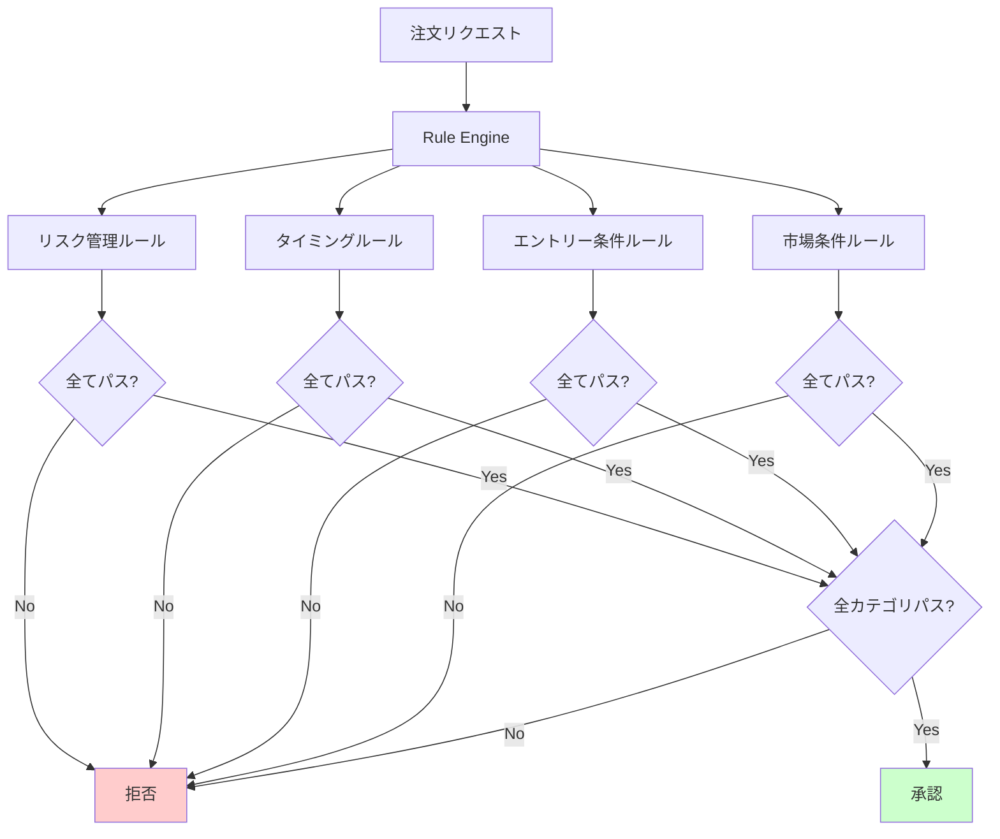
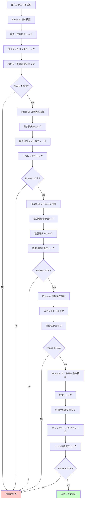
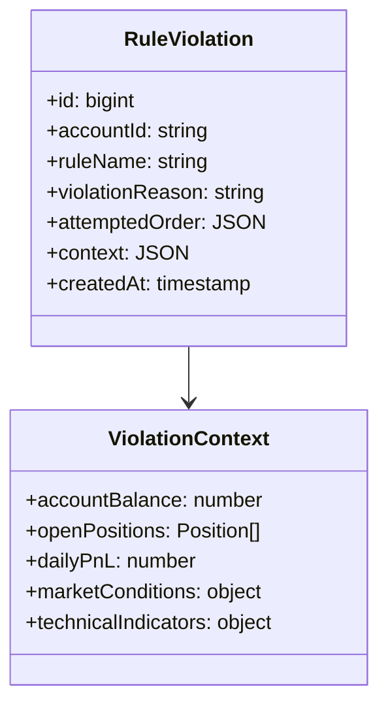
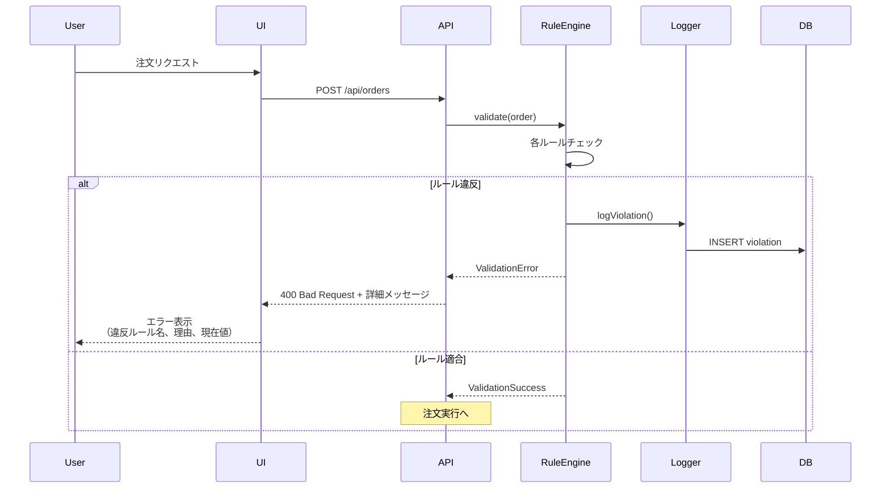
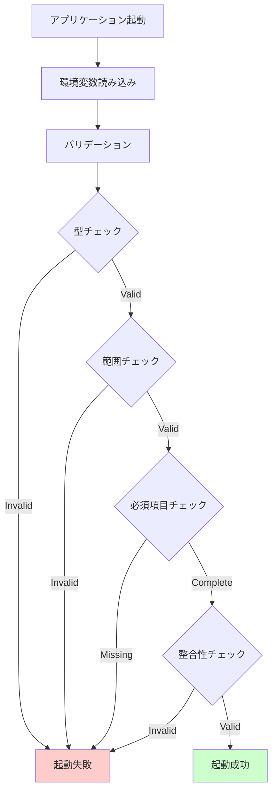
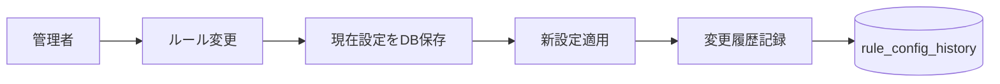

# ルールエンジン設計書

## 概要

このドキュメントでは、環境変数駆動のルールエンジンの詳細設計を定義します。

---

## 設計原則

1. **環境変数駆動**: 全てのルールパラメータを環境変数で定義
2. **完全ブロック**: 1つでもルール違反があれば注文を拒否
3. **透明性**: 違反理由を明確にログ記録
4. **柔軟性**: 環境ごとに異なるルール適用が可能

---

## ルールカテゴリ



---

## 1. リスク管理ルール

### 1.1 ポジションサイズ制限

**目的**: 1回の取引で過大なリスクを取らないようにする

**環境変数**:
```bash
MAX_POSITION_SIZE=10000      # 1ポジションの最大サイズ（通貨単位）
MIN_POSITION_SIZE=1000       # 1ポジションの最小サイズ
```

**検証ロジック**:
```
MIN_POSITION_SIZE <= 注文数量 <= MAX_POSITION_SIZE
```

**違反時メッセージ**:
- "ポジションサイズが最大値を超えています"
- "ポジションサイズが最小値を下回っています"

---

### 1.2 損切り・利確設定の強制

**目的**: 全てのポジションに損切りと利確を設定させる

**環境変数**:
```bash
STOP_LOSS_PIPS=20           # 必須の損切りライン（pips）
TAKE_PROFIT_PIPS=40         # 必須の利確ライン（pips）
ALLOW_MANUAL_SL_TP=false    # 手動設定を許可するか
```

**検証ロジック**:
- `ALLOW_MANUAL_SL_TP=false`の場合、環境変数の値を強制適用
- `ALLOW_MANUAL_SL_TP=true`の場合、手動設定を許可（ただし設定必須）

**違反時メッセージ**:
- "損切り設定が必須です"
- "利確設定が必須です"

---

### 1.3 日次損失制限

**目的**: 1日の損失が一定額を超えたら、その日の取引を停止

**環境変数**:
```bash
MAX_DAILY_LOSS=5000                # 1日の最大損失額（円）
MAX_DAILY_LOSS_PERCENTAGE=2.0      # 口座残高に対する最大損失率（%）
DAILY_LOSS_RESET_HOUR=0            # 損失カウントリセット時刻（JST）
```

**検証ロジック**:
```
当日の損失 < min(MAX_DAILY_LOSS, 口座残高 * MAX_DAILY_LOSS_PERCENTAGE / 100)
```

**違反時メッセージ**:
- "本日の損失上限に達しました。明日まで取引できません"

---

### 1.4 最大保有ポジション数

**目的**: 同時に保有できるポジション数を制限

**環境変数**:
```bash
MAX_OPEN_POSITIONS=5               # 最大同時保有ポジション数
MAX_POSITIONS_PER_PAIR=2           # 同一通貨ペアの最大ポジション数
```

**検証ロジック**:
```
現在のポジション数 < MAX_OPEN_POSITIONS
通貨ペアごとのポジション数 < MAX_POSITIONS_PER_PAIR
```

**違反時メッセージ**:
- "最大保有ポジション数に達しています"
- "この通貨ペアの最大ポジション数に達しています"

---

### 1.5 レバレッジ制限

**目的**: 実効レバレッジを制限してリスク管理

**環境変数**:
```bash
MAX_LEVERAGE=10                    # 最大レバレッジ倍率
```

**検証ロジック**:
```
実効レバレッジ = (全ポジション評価額 + 新規注文評価額) / 口座残高
実効レバレッジ <= MAX_LEVERAGE
```

**違反時メッセージ**:
- "レバレッジ上限を超えています"

---

## 2. タイミングルール

### 2.1 取引可能時間帯

**目的**: 特定の時間帯のみ取引を許可

**環境変数**:
```bash
TRADING_START_HOUR=9               # 取引開始時刻（時）
TRADING_START_MINUTE=0             # 取引開始時刻（分）
TRADING_END_HOUR=17                # 取引終了時刻（時）
TRADING_END_MINUTE=0               # 取引終了時刻（分）
TRADING_TIMEZONE=Asia/Tokyo        # タイムゾーン
```

**検証ロジック**:
```
現在時刻（タイムゾーン適用後） が 開始時刻 〜 終了時刻 の範囲内
```

**違反時メッセージ**:
- "取引可能時間外です（{開始時刻}〜{終了時刻}）"

---

### 2.2 取引可能曜日

**目的**: 特定の曜日のみ取引を許可

**環境変数**:
```bash
TRADING_ALLOWED_DAYS=1,2,3,4,5     # 許可曜日（0=日, 1=月, ..., 6=土）
```

**検証ロジック**:
```
現在の曜日 が TRADING_ALLOWED_DAYS に含まれる
```

**違反時メッセージ**:
- "この曜日は取引できません"

---

### 2.3 経済指標前後の取引制限

**目的**: ボラティリティが高い時間帯の取引を避ける

**環境変数**:
```bash
BLOCK_BEFORE_NEWS_MINUTES=30       # 指標発表前の制限時間（分）
BLOCK_AFTER_NEWS_MINUTES=10        # 指標発表後の制限時間（分）
NEWS_CALENDAR_ENABLED=true         # 経済指標カレンダー機能の有効化
HIGH_IMPACT_ONLY=true              # 高影響度指標のみブロック
```

**検証ロジック**:
```
次の重要経済指標までの時間 > BLOCK_BEFORE_NEWS_MINUTES
前回の重要経済指標からの時間 > BLOCK_AFTER_NEWS_MINUTES
```

**違反時メッセージ**:
- "経済指標発表前のため取引できません（{指標名} まで {残り時間}分）"
- "経済指標発表直後のため取引できません（あと {残り時間}分）"

---

## 3. エントリー条件ルール

### 3.1 RSI（相対力指数）

**目的**: RSIベースのエントリー条件

**環境変数**:
```bash
RSI_ENABLED=true                   # RSIルールの有効化
RSI_PERIOD=14                      # RSI期間
RSI_OVERSOLD=30                    # 売られ過ぎ閾値
RSI_OVERBOUGHT=70                  # 買われ過ぎ閾値
RSI_TIMEFRAME=M5                   # 使用する時間軸
```

**検証ロジック**:
- **買い注文**: RSI <= RSI_OVERSOLD（売られ過ぎ）
- **売り注文**: RSI >= RSI_OVERBOUGHT（買われ過ぎ）

**違反時メッセージ**:
- "RSI条件を満たしていません（現在: {RSI値}）"

---

### 3.2 移動平均線（MA）

**目的**: トレンドフォロー戦略

**環境変数**:
```bash
MA_ENABLED=true                    # MAルールの有効化
MA_SHORT_PERIOD=25                 # 短期MA期間
MA_LONG_PERIOD=75                  # 長期MA期間
MA_CROSSOVER_REQUIRED=true         # クロスオーバー必須
MA_TIMEFRAME=M15                   # 使用する時間軸
```

**検証ロジック**:
- **買い注文**: 短期MA > 長期MA（ゴールデンクロス状態）
- **売り注文**: 短期MA < 長期MA（デッドクロス状態）

**違反時メッセージ**:
- "移動平均線の条件を満たしていません"

---

### 3.3 ボリンジャーバンド

**目的**: ボラティリティベースのエントリー

**環境変数**:
```bash
BB_ENABLED=true                    # BBルールの有効化
BB_PERIOD=20                       # BB期間
BB_STD_DEV=2.0                     # 標準偏差倍率
BB_TIMEFRAME=M5                    # 使用する時間軸
```

**検証ロジック**:
- **買い注文**: 現在価格 <= 下部バンド
- **売り注文**: 現在価格 >= 上部バンド

**違反時メッセージ**:
- "ボリンジャーバンド条件を満たしていません"

---

### 3.4 トレンド強度

**目的**: 明確なトレンドがある時のみエントリー

**環境変数**:
```bash
TREND_STRENGTH_ENABLED=true        # トレンド強度チェックの有効化
MIN_TREND_STRENGTH=0.7             # 最小トレンド強度（0-1）
TREND_CALCULATION_METHOD=ADX       # トレンド計算手法（ADX, LinearRegression）
```

**検証ロジック**:
```
計算されたトレンド強度 >= MIN_TREND_STRENGTH
```

**違反時メッセージ**:
- "トレンド強度が不足しています（現在: {強度値}）"

---

## 4. 市場条件ルール

### 4.1 通貨ペア制限

**目的**: 取引可能な通貨ペアを限定

**環境変数**:
```bash
ALLOWED_CURRENCY_PAIRS=USD_JPY,EUR_JPY,GBP_JPY
```

**検証ロジック**:
```
注文の通貨ペア が ALLOWED_CURRENCY_PAIRS に含まれる
```

**違反時メッセージ**:
- "この通貨ペアは取引が許可されていません"

---

### 4.2 スプレッド制限

**目的**: スプレッドが広がっている時は取引しない

**環境変数**:
```bash
MAX_SPREAD_PIPS=3.0                # 最大許容スプレッド（pips）
CHECK_SPREAD_ENABLED=true          # スプレッドチェック有効化
```

**検証ロジック**:
```
現在のスプレッド <= MAX_SPREAD_PIPS
```

**違反時メッセージ**:
- "スプレッドが広すぎます（現在: {スプレッド} pips）"

---

### 4.3 流動性チェック

**目的**: 流動性が低い時間帯の取引を避ける

**環境変数**:
```bash
MIN_VOLUME_REQUIRED=1000           # 最小要求ボリューム
LIQUIDITY_CHECK_ENABLED=false      # 流動性チェック有効化
```

**検証ロジック**:
```
直近の取引ボリューム >= MIN_VOLUME_REQUIRED
```

**違反時メッセージ**:
- "市場の流動性が不足しています"

---

## ルールの優先順位と処理順序



**処理順序の理由**:
1. **Phase 1**: 最も基本的なチェック（計算不要）
2. **Phase 2**: 口座状態の確認（DB読み込み必要）
3. **Phase 3**: タイミング関連（システム時刻のみ）
4. **Phase 4**: 市場データ取得が必要
5. **Phase 5**: 最も計算コストが高い（テクニカル指標計算）

早い段階で拒否できるチェックを先に実行することで、パフォーマンスを最適化します。

---

## ルール違反時の動作

### ログ記録

全てのルール違反は以下の情報と共にDBに記録されます：



### ユーザーへの通知



---

## 環境変数のバリデーション

起動時に全ての環境変数をバリデーションします：



**チェック項目**:
- 型の正しさ（数値、文字列、真偽値）
- 範囲の妥当性（例: 0 < MAX_LEVERAGE <= 25）
- 必須項目の存在確認
- 論理的整合性（例: MIN < MAX）

---

## .env.example テンプレート

プロジェクトルートに `.env.example` を配置し、全ての環境変数を定義します。

詳細は [`../.env.example`](../.env.example) を参照してください。

---

## ルール設定変更履歴の管理



全ての環境変数変更を `rule_config_history` テーブルに記録し、いつでも過去の設定に戻せるようにします。

---

## 今後の拡張

### Phase 2で追加予定のルール

- **相関ルール**: 相関の高い通貨ペアの同時保有を制限
- **時間帯別ルール**: 時間帯ごとに異なるルール適用
- **自動損切りトレール**: トレンドに応じた動的損切り

### Phase 3で追加予定

- **機械学習ベースルール**: 過去データから最適なルールパラメータを提案
- **バックテスト連動**: バックテスト結果に基づくルール自動調整
