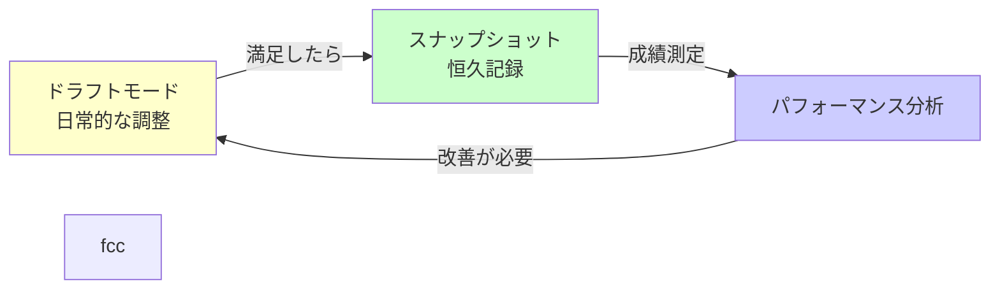
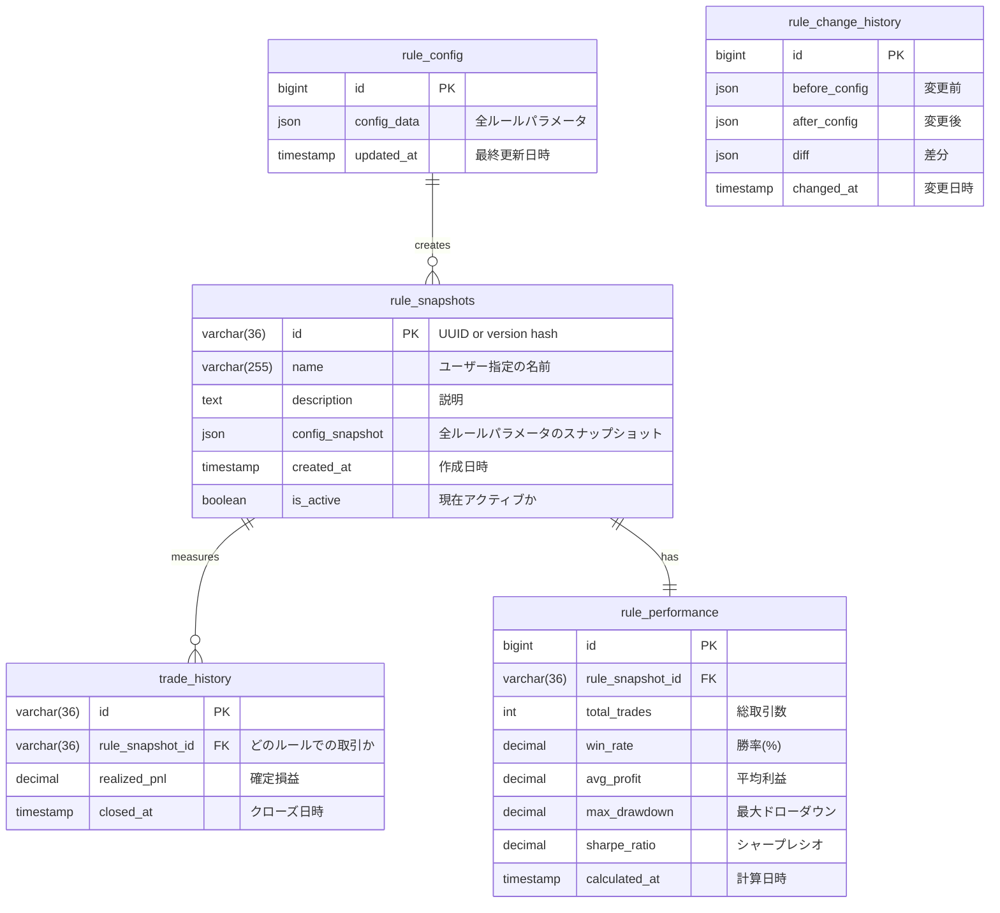
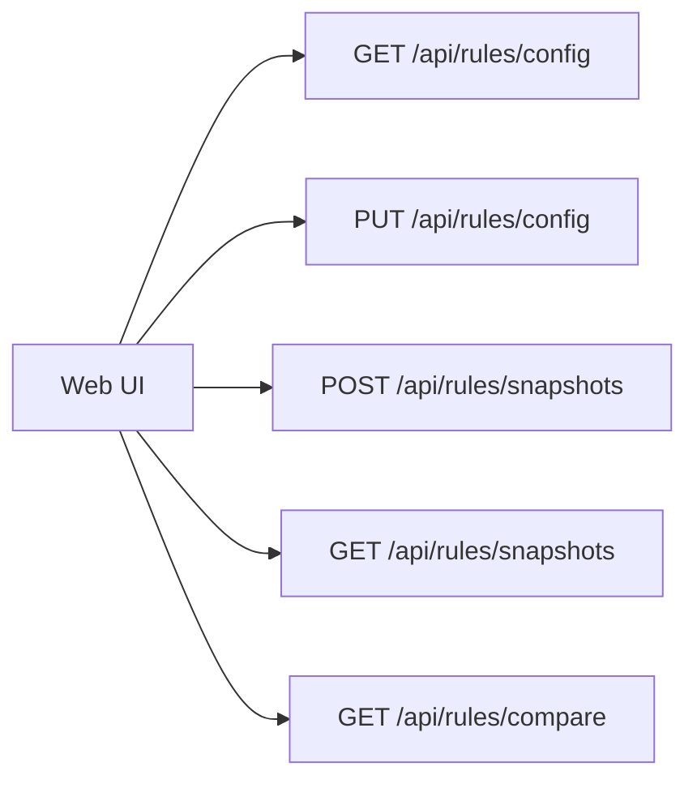
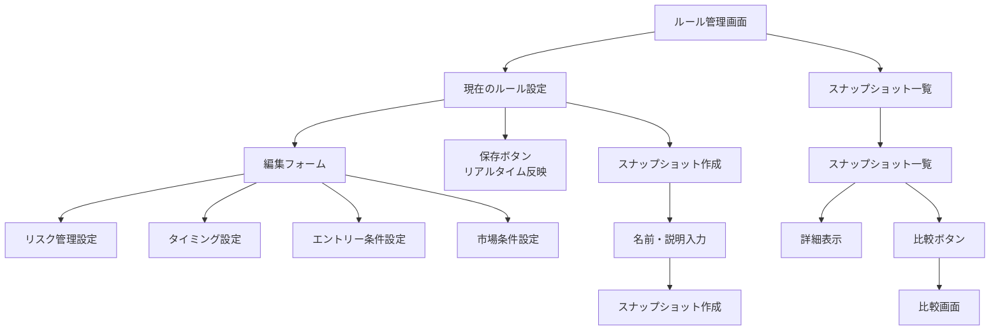
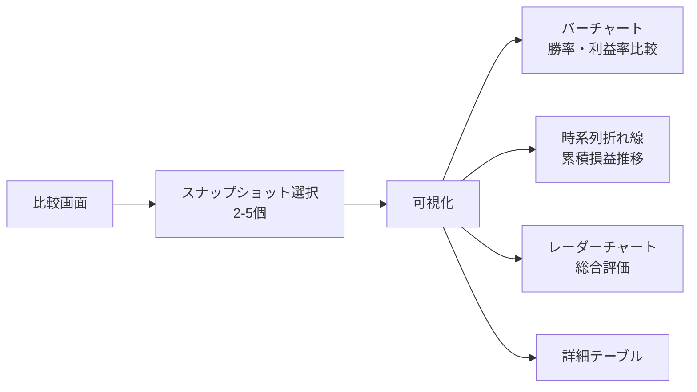
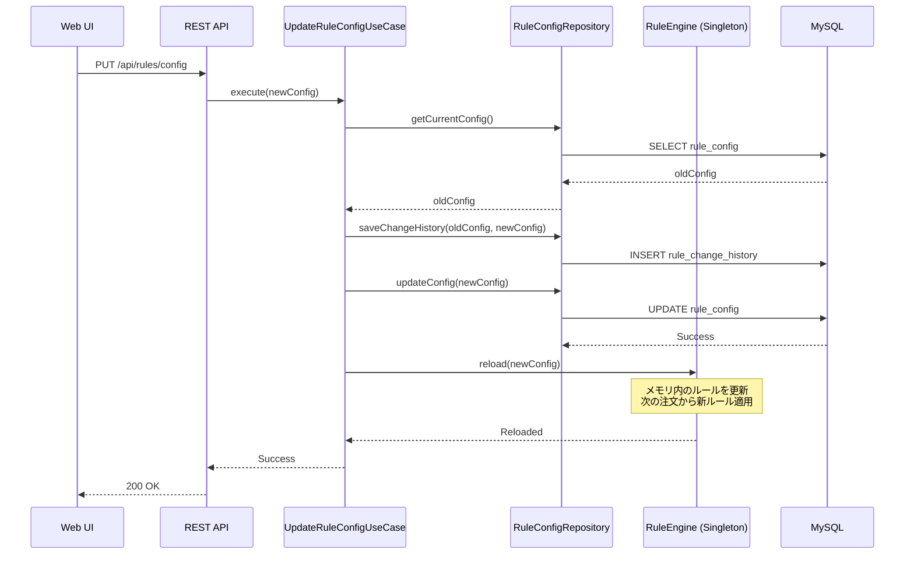
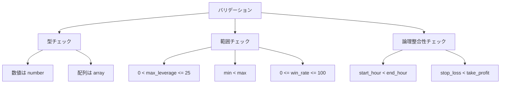

# ルール管理システム設計書

## 概要

このドキュメントでは、DB駆動のルール管理システムの詳細設計を定義します。

---

## 設計コンセプト

### 2つのモード



### モード1: ドラフトモード（日常的な調整）

**目的**: 気軽にルールを試行錯誤する

**特徴**:
- ルールを自由に変更できる
- **リアルタイムで反映**（システム再起動不要）
- 履歴は残るが簡易的
- 取引成績とは紐づけない（微調整のたびに記録するのは無駄）

**ユースケース**:
- RSIの閾値を30→28に微調整
- 損切りラインを20pips→25pipsに変更
- 「ちょっと試してみたい」レベルの変更

---

### モード2: スナップショット（恒久記録）

**目的**: 「このルールで本気で運用する」と決めたルールセットを記録

**特徴**:
- ユーザーが明示的に「コミット」する
- **一意のバージョン番号**で管理
- 名前・説明を付けられる（例: "保守的v1", "RSI調整後"）
- このルールでの**全取引を紐づけて記録**
- 後で「どのルールが一番良かったか」を**視覚的に比較**できる

**ユースケース**:
- 1週間試してみて良さそうだから記録
- 本番運用開始時にスナップショット作成
- 複数のルールセットで成績を比較

---

## データベース設計

### ER図



---

### テーブル定義

#### rule_config（現在のルール設定）

**目的**: 現在アクティブなルール設定を保存

| カラム | 型 | NULL | 説明 |
|--------|-------|------|------|
| id | BIGINT | NO | 常に1レコードのみ（id=1固定） |
| config_data | JSON | NO | 全ルールパラメータ |
| updated_at | TIMESTAMP | NO | 最終更新日時 |

**config_data の構造**:
```json
{
  "risk_management": {
    "max_position_size": 10000,
    "min_position_size": 1000,
    "stop_loss_pips": 20,
    "take_profit_pips": 40,
    "max_daily_loss": 5000,
    "max_daily_loss_percentage": 2.0,
    "max_open_positions": 5,
    "max_leverage": 10
  },
  "timing": {
    "trading_start_hour": 9,
    "trading_end_hour": 17,
    "trading_allowed_days": [1, 2, 3, 4, 5],
    "block_before_news_minutes": 30,
    "block_after_news_minutes": 10
  },
  "entry_conditions": {
    "rsi_enabled": true,
    "rsi_period": 14,
    "rsi_oversold": 30,
    "rsi_overbought": 70,
    "ma_enabled": true,
    "ma_short_period": 25,
    "ma_long_period": 75
  },
  "market_conditions": {
    "allowed_currency_pairs": ["USD_JPY", "EUR_JPY"],
    "max_spread_pips": 3.0
  }
}
```

---

#### rule_snapshots（恒久記録用スナップショット）

**目的**: ユーザーがコミットしたルールセットを一意に管理

| カラム | 型 | NULL | 説明 |
|--------|-------|------|------|
| id | VARCHAR(36) | NO | UUID or SHA-256ハッシュ |
| name | VARCHAR(255) | NO | ユーザー指定の名前（例: "保守的v1"） |
| description | TEXT | YES | 説明（例: "RSIを30→28に調整"） |
| config_snapshot | JSON | NO | ルール設定の完全なスナップショット |
| created_at | TIMESTAMP | NO | 作成日時 |
| is_active | BOOLEAN | NO | 現在このルールで運用中か |

**インデックス**:
- PRIMARY KEY: `id`
- INDEX: `(created_at)`
- INDEX: `(is_active)`

---

#### trade_history（取引履歴）- 拡張版

**変更点**: `rule_snapshot_id` カラムを追加

| カラム | 型 | NULL | 説明 |
|--------|-------|------|------|
| id | VARCHAR(36) | NO | UUID |
| account_id | VARCHAR(36) | NO | 口座ID |
| rule_snapshot_id | VARCHAR(36) | **YES** | どのルールで取引したか（NULL=ドラフト） |
| currency_pair | VARCHAR(10) | NO | 通貨ペア |
| realized_pnl | DECIMAL(15,2) | NO | 確定損益 |
| opened_at | TIMESTAMP | NO | オープン日時 |
| closed_at | TIMESTAMP | NO | クローズ日時 |
| ... | ... | ... | その他カラム |

**インデックス**:
- INDEX: `(rule_snapshot_id, closed_at)` - ルール別成績集計用

**重要**:
- `rule_snapshot_id` がNULL = ドラフトモードでの取引（成績測定対象外）
- `rule_snapshot_id` がセット = スナップショットモードでの取引（成績測定対象）

---

#### rule_performance（ルール別パフォーマンス）

**目的**: 各スナップショットの成績をサマリー

| カラム | 型 | NULL | 説明 |
|--------|-------|------|------|
| id | BIGINT | NO | Auto Increment |
| rule_snapshot_id | VARCHAR(36) | NO | FK to rule_snapshots |
| total_trades | INT | NO | 総取引数 |
| winning_trades | INT | NO | 勝ちトレード数 |
| losing_trades | INT | NO | 負けトレード数 |
| win_rate | DECIMAL(5,2) | NO | 勝率（%） |
| total_pnl | DECIMAL(15,2) | NO | 総損益 |
| avg_profit | DECIMAL(15,2) | NO | 平均利益 |
| avg_loss | DECIMAL(15,2) | NO | 平均損失 |
| profit_factor | DECIMAL(10,4) | NO | プロフィットファクター |
| max_drawdown | DECIMAL(15,2) | NO | 最大ドローダウン |
| sharpe_ratio | DECIMAL(10,4) | YES | シャープレシオ |
| calculated_at | TIMESTAMP | NO | 計算日時 |

**インデックス**:
- PRIMARY KEY: `id`
- UNIQUE: `(rule_snapshot_id)`
- INDEX: `(win_rate)` - 勝率順ソート用

---

#### rule_change_history（ルール変更履歴）

**目的**: ドラフトモードでの変更履歴を記録

| カラム | 型 | NULL | 説明 |
|--------|-------|------|------|
| id | BIGINT | NO | Auto Increment |
| before_config | JSON | YES | 変更前の設定 |
| after_config | JSON | NO | 変更後の設定 |
| diff | JSON | YES | 差分（変更箇所のみ） |
| changed_at | TIMESTAMP | NO | 変更日時 |

**diff の例**:
```json
{
  "risk_management.stop_loss_pips": {
    "old": 20,
    "new": 25
  },
  "entry_conditions.rsi_oversold": {
    "old": 30,
    "new": 28
  }
}
```

---

## API設計

### ルール管理API



#### GET /api/rules/config
現在のルール設定を取得

**レスポンス**:
```json
{
  "config": { /* config_data */ },
  "updated_at": "2025-01-15T10:30:00Z"
}
```

---

#### PUT /api/rules/config
ルール設定を更新（**リアルタイム反映**）

**リクエスト**:
```json
{
  "config": { /* 新しいconfig_data */ }
}
```

**処理フロー**:
1. バリデーション（整合性チェック）
2. 変更履歴を `rule_change_history` に保存
3. `rule_config` を更新
4. **RuleEngine をリロード**（メモリ内のルールを更新）
5. 成功レスポンス

**レスポンス**:
```json
{
  "success": true,
  "updated_at": "2025-01-15T11:00:00Z"
}
```

---

#### POST /api/rules/snapshots
現在のルール設定をスナップショットとして保存

**リクエスト**:
```json
{
  "name": "保守的v1",
  "description": "RSIを28に調整、損切りを25pipsに設定"
}
```

**処理フロー**:
1. 現在の `rule_config` を取得
2. config のハッシュを計算（SHA-256）
3. `rule_snapshots` に新規レコード作成
4. 既存のアクティブスナップショットを非アクティブ化
5. 新スナップショットをアクティブ化
6. 以降の取引は `trade_history.rule_snapshot_id` にこのIDをセット

**レスポンス**:
```json
{
  "id": "a7f3c2b1-...",
  "name": "保守的v1",
  "created_at": "2025-01-15T12:00:00Z"
}
```

---

#### GET /api/rules/snapshots
全スナップショット一覧を取得

**レスポンス**:
```json
{
  "snapshots": [
    {
      "id": "a7f3c2b1-...",
      "name": "保守的v1",
      "description": "...",
      "created_at": "2025-01-15T12:00:00Z",
      "is_active": true,
      "performance": {
        "total_trades": 25,
        "win_rate": 68.0,
        "total_pnl": 15000
      }
    },
    ...
  ]
}
```

---

#### GET /api/rules/compare?ids=id1,id2,id3
複数のスナップショットを比較

**レスポンス**:
```json
{
  "comparison": [
    {
      "id": "a7f3c2b1-...",
      "name": "保守的v1",
      "performance": {
        "total_trades": 25,
        "win_rate": 68.0,
        "avg_profit": 600,
        "max_drawdown": -3000,
        "sharpe_ratio": 1.8
      }
    },
    {
      "id": "b8e4d3c2-...",
      "name": "積極的v1",
      "performance": {
        "total_trades": 45,
        "win_rate": 55.6,
        "avg_profit": 800,
        "max_drawdown": -5500,
        "sharpe_ratio": 1.2
      }
    }
  ],
  "metrics": ["total_trades", "win_rate", "avg_profit", "max_drawdown", "sharpe_ratio"]
}
```

---

## UI設計

### ルール管理画面



### ルール比較・可視化画面



---

## 可視化の詳細設計

### 使用ライブラリ: Recharts

#### 1. パフォーマンス比較バーチャート

**表示指標**:
- 総取引数
- 勝率（%）
- 平均利益
- 最大ドローダウン
- シャープレシオ

**コンポーネント**: `<BarChart>` with `<Bar>` per snapshot

---

#### 2. 累積損益推移（時系列）

**表示内容**:
- X軸: 日付
- Y軸: 累積損益
- 各スナップショットごとに異なる色の線

**コンポーネント**: `<LineChart>` with multiple `<Line>`

---

#### 3. レーダーチャート（総合評価）

**軸**:
- 勝率
- 平均利益
- リスクリワード比
- 取引頻度
- 安定性（ドローダウンの逆数）

**コンポーネント**: `<RadarChart>`

---

#### 4. 詳細比較テーブル

**表示項目**:
```
| 指標 | ルールA | ルールB | ルールC |
|------|---------|---------|---------|
| 総取引数 | 25 | 45 | 30 |
| 勝率 | 68% | 56% | 72% |
| 総損益 | +15,000 | +18,000 | +12,000 |
| 平均利益 | 600 | 400 | 400 |
| 最大DD | -3,000 | -5,500 | -2,500 |
| Sharpe | 1.8 | 1.2 | 2.1 |
```

---

## リアルタイム反映の仕組み



---

## バリデーション

### ルール設定のバリデーション



---

## 今後の拡張

### Phase 2
- **ルールプリセット**: 事前定義済みのルールセット（保守的、標準、積極的）
- **A/Bテスト**: 2つのルールを並行稼働して比較

### Phase 3
- **バックテスト連動**: スナップショット作成前にバックテスト実行
- **機械学習最適化**: 過去データから最適なルールパラメータを提案
